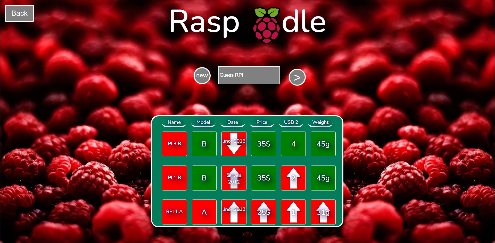

# Raspdle

<!-- PROJECT LOGO -->
 

  

  <h3 align="center">Rasp🍓dle</h3>

  

    Minigame for raspberry nerds. 🤓
     
    <a href="https://raspdle.000webhostapp.com"><strong>View game »</strong></a>
     
     
    <a href="https://github.com/1Jupcek0/Raspdle">View Docs</a>
    ·
    <a href="https://github.com/1Jupcek0/Raspdle/issues">Report Bug</a>
    ·
    <a href="https://github.com/1Jupcek0/Raspdle/issues">Request Feature</a>
  

## 

  

## Built With

 

 

 

